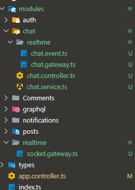

# Socket.io real time chat

- first in `app.controller` init const httpServer and init listen port like this

```tsx
const httpServer = app.listen(port, () => {
  console.log(`Server is running on port ${port}`);
});
const io = new Server(httpServer);
```

- then

```tsx
const io = new Server(httpServer);
io.on('connection', (socket) => {
  console.log(socket); //
  console.log('a user connected with id ' + socket.id);
});
```

- `console.log(socket)` **object with a lot of information about the connection, including the id of the socket, the handshake data, and the rooms that the socket is currently in.**

- **every tap contain socket.id is unique for every connection, so we can use it to identify the user who is connected to the socket, and we can use it to send messages to that specific user by using io.to(socket.id).emit() method, and we can also use it to join rooms by using socket.join(roomName) method, and we can use it to leave rooms by using socket.leave(roomName) method, and we can also use it to broadcast messages to all users except the sender by using socket.broadcast.emit() method, and we can also use it to broadcast messages to all users in a specific room except the sender by using socket.to(roomName).emit() method.**

- socketid regenerate with refresh and destroy

- sender make emit receiver make on

- in postman make request type `socket.io` and add url and in felid event name add eventName and take this event to make `on` to apply UR OP

```tsx
io.on('connection', (socket) => {
  console.log('a user connected with id ' + socket.id);

  socket.on('sayHi', (data) => {
    console.log('Received sayHi event with data:', data);
  });
});
```

```cmd
[1] a user connected with id Q90hcKNj5apip_f-AAAB
[1] Received sayHi event with data: hi mr fakhora how are you
```

- now we need to make emit to send message to client

```tsx
socket.on('sayHi', (data) => {
  //   console.log('Received sayHi event with data:', data);
  // Emit a response back to the client
  socket.emit('sayHiBack', { message: 'Hi from the server!' });
});
```

- take this `sayHiBack` event and on postman contain Event add this eventName and send message send to client and response from server

- `callback ` make emit without write event but make on `Ack`

```tsx
socket.on('sayHi', (data, cb) => {
  console.log('Received sayHi event with data:', data);
  // Emit a response back to the client
  // socket.emit("sayHiBack", { message: "Hi from the server!" });
  cb({ message: 'Hi from the server!' });
});
```

### integrate with front

- first `npm i socket.io` in file front and create html and js file to connect

```html
<!doctype html>
<html lang="en">
  <head>
    <meta charset="UTF-8" />
    <meta name="viewport" content="width=device-width, initial-scale=1.0" />
    <title>Document</title>
  </head>
  <body>
    <script src="/node_modules/socket.io/client-dist/socket.io.min.js"></script>
    <script src="./index.js"></script>
  </body>
</html>
```

- this in file js

```js
const clientIo = io('http://localhost:3000');
```

- now we connected with us now you make emit and on events to send messages and receive it
- in this EX

```js
clientIo.emit('hi', 'Hello from the client!');
```

- now we make event name hi to send message and we need to make `on` to receive this message

```js
socket.on('hi', (data) => {
  console.log('Received hi event with data:', data);
});
```

- this full code for both to show another EX
  > app.controller

```js
const httpServer = app.listen(port, () => {
  console.log(`Server is running on port ${port}`);
});
const io = new Server(httpServer, {
  cors: {
    origin: '*',
  },
});
io.on('connection', (socket) => {
  console.log('a user connected with id ' + socket.id);
  socket.on('hi', (data) => {
    console.log('Received hi event with data:', data);
  });
  socket.emit('welcome', 'Hello from the BE!');
});
```

- take care about cors
  > index.js

```js
const clientIo = io('http://localhost:3000');

clientIo.emit('hi', 'Hello from the client!');

clientIo.on('welcome', (message) => {
  console.log(message);
});
```

### socket events

#### Routes (of) `Multiplexing`

```js
const clientIoAdmin = io('http://localhost:3000/admin');
```

- in controller

```js
io.of('/admin').on('connection', (socket) => {
  console.log('================================');
  console.log('a user connected with id admin' + socket.id);
});
```

- this event run only in route admin

> **when make two or more tap and need to send message to all of them we can use io.emit instead of socket.emit because socket.emit will send the message to the current connected client only but io.emit will send the message to all connected clients**

```js
io.emit('welcome', 'Hello from the BE!');
```

- send for all
- socket send only has send message
- send to all without current client
  > broadcasting

```js
socket.broadcast.emit('welcome', 'Hello from the BE!');
```

- send to specific client
- socket.to("specific socket id").emit("welcome", "Hello from the BE!");
- and in frontend store id in local storage and send it with every request to identify the client and send message to it

```js
        socket.on("hi", (data: any) => {
            console.log("Received hi event with data:", data);
            // take id and create in local storage socketId and add id and this id only send message to it
            socket.to(data.id).emit("welcome", "Hello from the BE!");

        })

```

in index.js

```js
const clientIo = io('http://localhost:3000');

clientIo.emit('hi', { id: localStorage.getItem('socketId') });
```

- some data

```js
        // socket.emit("welcome", "Hello from the BE!");
        // when make two or more tap and need to send message to all of them we can use io.emit instead of socket.emit because socket.emit will send the message to the current connected client only but io.emit will send the message to all connected clients
        // io.emit("welcome", "Hello from the BE!");
        // send to all without current client\
        // socket.broadcast.emit("welcome", "Hello from the BE!");
        // send to specific client
        // socket.to("specific socket id").emit("welcome", "Hello from the BE!");
        // and in frontend store id in local storage and send it with every request to identify the client and send message to it

        socket.on("hi", (data: any) => {
            console.log("Received hi event with data:", data);
            // take id and create in local storage socketId and add id and this id only send message to it
            socket.to(data.id).emit("welcome", "Hello from the BE!");

            // send to array

            // send to all without specific client and sender
            socket.except(data.id).emit("welcome", "Hello from the BE!");

            // send to all without specific clients
            io.except(data.id).emit("welcome", "Hello from the BE!");})
```

### authentication

- in controller

```js
io.use(async (socket, next) => {
  try {
    console.log('socket handshake auth', socket.handshake.auth.authorization);
    const { user } = await authenticationFunc(
      socket.handshake.auth.authorization,
    );
    socket.data.user = user;
    next();
  } catch (err) {
    next(new AppError('Unauthorized', 401));
  }
});
```

- in index.js

```js
const clientIo = io('http://localhost:3000', {
  auth: {
    token: `bearer ${localStorage.getItem('authorization')}`,
  },
});
```

#### auth and store socketId in redis

```js
io.use(async (socket, next) => {
  try {
    console.log('socket handshake auth', socket.handshake.auth.authorization);

    const { user } = await authenticationFunc(
      socket.handshake.auth.authorization ||
        socket.handshake.headers.authorization,
    );

    socket.data.user = user;

    next();
  } catch (err) {
    console.log('AUTH ERROR =>', err);
    next(new AppError('Unauthorized', 401));
  }
});
```

- and this make connect

```js
io.on('connection', async (socket) => {
  console.log('hi');
  redisService.addSocket({ userId: socket.data.user._id, socketId: socket.id });
  console.log({
    userSocketId: await redisService.getSockets(socket.data.user._id),
  });

  // to remove socketid when disconnect
  socket.on('disconnect', async () => {
    await redisService.removeSocket({
      userId: socket.data.user._id,
      socketId: socket.id,
    });
    console.log({
      userSocketIdsAfterDisconnect: await redisService.getSockets(
        socket.data.user._id,
      ),
    });
  });
});
```

### folder structure



- first create module `realtime` include `socket.gateway.ts`
- add all code about `io`
- `socket.gateway.ts`

```ts
import { Server } from 'socket.io';
import { Server as httpServer } from 'http';
import { authenticationFunc } from '../../common/utils/authFunction';
import redisService from '../../common/services/redis.service';
import { AppError } from '../../common/utils/global-error-handling';
import chatGateway from '../chat/realtime/chat.gateway';

class SocketGateway {
  constructor() {}

  initIo = async (httpServer: httpServer) => {
    const io = new Server(httpServer, {
      cors: {
        origin: '*',
      },
    });
    // auth

    io.use(async (socket, next) => {
      try {
        console.log(
          'socket handshake auth',
          socket.handshake.auth.authorization,
        );

        const { user } = await authenticationFunc(
          socket.handshake.auth.authorization ||
            socket.handshake.headers.authorization,
        );

        socket.data.user = user;

        next();
      } catch (err) {
        console.log('AUTH ERROR =>', err);
        next(new AppError('Unauthorized', 401));
      }
    });
    io.on('connection', async (socket) => {
      redisService.addSocket({
        userId: socket.data.user._id,
        socketId: socket.id,
      });
      // console.log({ userSocketId: await redisService.getSockets(socket.data.user._id) })
      await chatGateway.registerEvent(socket);
      // from gateway -> chatEvent -> service
      // to remove socketid when disconnect
      socket.on('disconnect', async () => {
        await redisService.removeSocket({
          userId: socket.data.user._id,
          socketId: socket.id,
        });
        console.log({
          userSocketIdsAfterDisconnect: await redisService.getSockets(
            socket.data.user._id,
          ),
        });
      });
    });
  };
}

export default new SocketGateway();
```

- then create module chat include dir `realtime` contain `chat.event.ts` and `chat.gateway.ts` and chat contain two fils `controller` and `service`
- first in `socket.gateway.ts` make event listener

```ts
await chatGateway.registerEvent(socket);
```

- then go to `chat.gateway.ts` to create this listener

```ts
import { Socket } from 'socket.io';
import chatEvent from './chat.event';

class ChatGateway {
  constructor() {}

  registerEvent = async (socket: Socket) => {
    chatEvent.sayHi(socket);
  };
}

export default new ChatGateway();
```

- then go to `chat.event.ts` to create this event

```ts
import { Socket } from 'socket.io';
import chatService from '../chat.service';

class ChatEvent {
  constructor() {}

  sayHi = async (socket: Socket) => {
    socket.on('sayHi', (data) => {
      chatService.sayHi(data);
    });
  };
}
export default new ChatEvent();
```

- and in the end go to service

```ts
class ChatService {
  constructor() {}

  // rest apis

  // socket.io

  sayHi = async (data: any) => {
    console.log(data);
  };
}
export default new ChatService();
```

#### model
